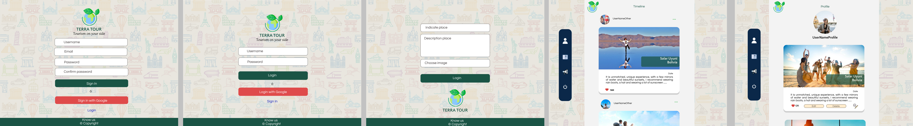

# TERRA TOUR: Tourism by your side (Social Network) 

## 1. Preámbulo 🌎

__Terra tour - el turismo de tu lado:__   _Red social_ que tiene como objetivo generar espacios de encuentros digitales para el sector del turismo, es decir, establecer recomendaciones de lugares visitados para futuros pasajeros a bordo de su próximo destino. 

## 2. Definición del producto 👩🏻‍💻

 __Usuarios:__ Los principales usuarios de Terra Tour, son los turistas, quienes se encuentran en diferentes momentos planeando su próximo viaje.
 La aplicación permite generar recomendaciones pertinentes de lugares a visitar desde experiencias propias, estableciendo así expectativas claras del siguiente destino.

Además, permite tener un rol activo en la red social generando espacios digitales para recomendar y/o leer recomendaciones, dar like a las publicaciones favoritas y dedicarse a conocer el mundo. 

### 2.1 Historias de usuario. 📚

Para la organización de la aplicación utilizamos metodología SCRUM e [historias de usuarios](https://trello.com/b/MkSm3wi1/social-network) mediante la herramienta Trello.

### 2.2 Diseño de Interfaz: Prototipo de Alta Fidelidad 🎨

## 3. Objetivos de aprendizaje 🚦

### HTML y CSS

* [ ] Uso de HTML semántico.
* [ ] Uso de selectores de CSS.
* [ ] Construir tu aplicación respetando el diseño realizado (maquetación).
* [ ] Uso de flexbox en CSS.

### DOM y Web APIs

* [ ] Uso de selectores del DOM.
* [ ] Manejo de eventos del DOM.
* [ ] Manipulación dinámica del DOM.
(appendChild |createElement | createTextNode| innerHTML | textContent | etc.)
* [ ] History API.
* [ ] localStorage.

### JavaScript

* [ ] Uso de condicionales (if-else | switch | operador ternario)
* [ ] Uso de funciones (parámetros | argumentos | valor de retorno)
* [ ] Manipular arrays (filter | map | sort | reduce)
* [ ] Manipular objects (key | value)
* [ ] Uso ES modules (`import`
| `export`)
* [ ] Diferenciar entre expression y statements.
* [ ] Diferenciar entre tipos de datos primitivos y no primitivos.
* [ ] Uso de callbacks.
* [ ] Consumo de Promesas.

### Testing

* [ ] Testeo unitario.
* [ ] Testeo asíncrono.
* [ ] Uso de librerias de Mock.

### Estructura del código y guía de estilo

* [ ] Organizar y dividir el código en módulos (Modularización)
* [ ] Uso de identificadores descriptivos (Nomenclatura | Semántica)
* [ ] Uso de linter (ESLINT)

### Git y Github

* [ ] Uso de comandos de git (add | commit | pull | status | push)
* [ ] Manejo de repositorios de GitHub (clone | fork | gh-pages)
* [ ] Colaboración en Github (branches | pull requests | |tags)
* [ ] Organización en Github (projects | issues | labels | milestones)

### Firebase

* [ ] Firestore.
* [ ] Firebase Auth.
* [ ] Firebase security rules.
* [ ] Observadores. (onAuthStateChanged
 | onSnapshot)

### UX

* [ ] Diseñar la aplicación pensando y entendiendo al usuario.
* [ ] Crear prototipos para obtener feedback e iterar.
* [ ] Aplicar los principios de diseño visual (contraste, alineación, jerarquía)
* [ ] Planear y ejecutar tests de usabilidad.
